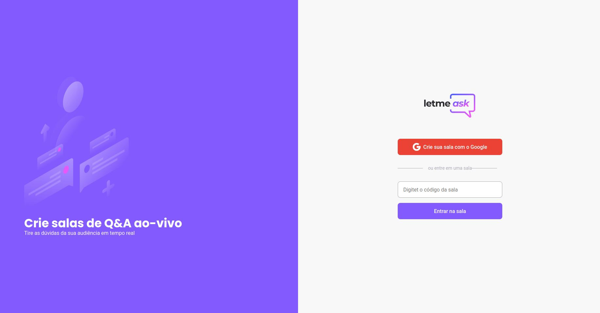

<h1 align="center" >
    
</h1>

<h1 align="center">
    
</h1>

# Sobre 🚀
**Letmeask** é um
projeto desenvolvido com o intuito de facilitar a interação entre streamer e o seu público. Para isso, o streamer cria uma sala, a qual compartilha o link com o espectadores, onde irão fazer cadastro e sair perguntando.

Desenvolvido junto com Diego Fernandes na Next Level Week(NLW) da escola de programação [**Rocketseat**](https://app.rocketseat.com.br/dashboard). 

---
## Principais conceitos desenvolvidos
- A tríade do ReactJs: Componente, Propriedade e Estado
- Context Api
- Hooks
- Firebase: Autenticação, Real time Database e hosting via CLI

---

# Tecnologias 
- TypeScript
- ReactJS
- Sass
- Firebase
